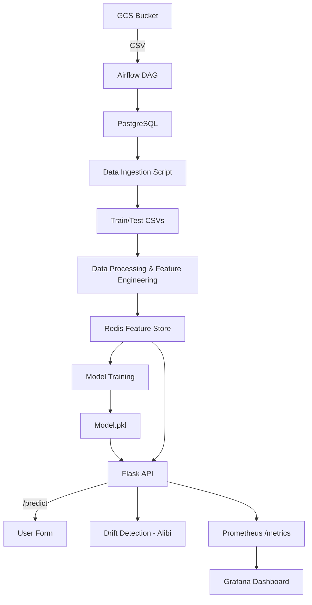

# 🚀 SurviverFlow – End-to-End MLOps Pipeline for Survival Prediction

[](https://www.python.org/)
[](https://flask.palletsprojects.com/)
[](https://upstash.com/)
[](https://airflow.apache.org/)
[](https://prometheus.io/)
[](https://grafana.com/)
[](https://surviverflow-1.onrender.com)
[](LICENSE)

SurviverFlow is a **production-ready MLOps pipeline** that predicts Titanic passenger survival with a fully automated workflow — covering everything from data ingestion to deployment, drift detection, monitoring, and feature storage.

---

## 📌 Key Features

- ✅ Data Ingestion from GCP → PostgreSQL via Airflow
- 🔧 ETL Pipeline with Airflow DAG
- 🧠 Model Training with Hyperparameter Tuning
- ⚙️ Feature Store using Redis (local & cloud)
- 📊 Drift Detection via Alibi-Detect
- 📈 Monitoring using Prometheus + Grafana
- 🌐 Real-time Flask Web App
- 🐳 Dockerized & Deployed on Render

---

## 🧱 Architecture Overview


---

## 🗂️ Project Structure

```
SURVIVERFLOW-main
├── app.py                      # Main Flask app
├── Dockerfile
├── README.md
├── .astro/                     # Astro & Airflow configs
├── dags/                       # Airflow DAGs
│   └── extract_data_from_gcp.py
├── src/                        # Core Python modules
│   ├── data_ingestion.py
│   ├── data_processing.py
│   ├── model_trainer.py
│   ├── feature_store.py
│   └── logger.py
├── pipeline/                   # Training pipeline script
├── artifacts/                  # Saved model + raw data
│   ├── models/random_forest_model.pkl
├── config/                     # Config paths and DB settings
├── notebook/                   # Jupyter testing
├── prometheus.yml              # Prometheus config
├── render.yml                  # Render deployment config
├── requirements.txt
└── setup.py
```

---


---

## 🔄 MLOps Pipeline Breakdown

### 🧮 Step 1: Data Ingestion

- Extract CSV from GCS Bucket
- Use Airflow DAG to load data into PostgreSQL
- Validated schema + nulls

### 🗃️ Step 2: Feature Store with Redis

- Built a Redis-based store for storing ML features
- Batch + individual read/write support
- Used both Docker Redis (local) and Upstash (Render)

### 🧼 Step 3: Data Preprocessing

- Handled missing values (Age, Fare, Embarked)
- Applied Label Encoding
- Feature Engineered: Title, FamilySize, HasCabin
- Used SMOTE for class balancing
- Stored all features in Redis via `entity_id`

### 🧠 Step 4: Model Training

- Fetched data from Redis, not CSV
- Trained `RandomForestClassifier` with `RandomizedSearchCV`
- Evaluated using accuracy + confusion matrix
- Saved model as `random_forest_model.pkl`

### 🔮 Step 5: Real-Time Prediction + Drift Detection

- Flask `/predict` accepts form input
- Loads saved model, scales features
- Alibi-Detect `KSDrift` compares with reference
- Logs drift if detected and updates Prometheus counters

### 📊 Step 6: Monitoring

- Prometheus `/metrics` endpoint tracks:
  - `prediction_count`
  - `drift_count`
- Grafana dashboards visualize drift and usage

### 🚀 Step 7: Deployment with Docker + Render

- Built Docker image with Gunicorn serving Flask
- `render.yml` defines container deployment
- Uses Upstash Redis URL via Render secrets

---

## 🖼️ Live Web App Interface

### ✅ Likely to Survive  


### ❌ Likely to Not Survive  


---

## 📊 Monitoring via Grafana


---

## ⚙️ Tech Stack

| Layer          | Tools Used                              |
|----------------|------------------------------------------|
| Data Storage   | GCP Bucket, PostgreSQL                   |
| Orchestration  | Airflow (Astro CLI)                      |
| ML Training    | Scikit-learn, Pandas, Numpy              |
| Feature Store  | Redis (Docker + Upstash)                 |
| Drift Detect   | Alibi-Detect (KSDrift)                   |
| Monitoring     | Prometheus + Grafana                     |
| App Layer      | Flask, HTML                              |
| Deployment     | Docker, Render                           |

---

## 🔧 How to Run Locally

```bash
# 1. Clone the Repo
git clone https://github.com/aimldinesh/SURVIVERFLOW.git
cd SURVIVERFLOW

# 2. Set Redis URL in .env
echo "REDIS_URL=your_upstash_redis_url" > .env

# 3. Run Flask App Locally
python app.py

# OR Build with Docker
docker build -t survivorflow-app .
docker run -p 5000:5000 survivorflow-app

## 🌍 Deployment (Render)

> Render setup with Docker + Redis service

- Redis connected via `REDIS_URL` from Upstash
- `render.yml` configured with:
```yaml
services:
  - type: web
    name: survivorflow-app
    env: docker
    dockerfilePath: ./Dockerfile
    envVars:
      - key: REDIS_URL
        sync: false  # Set manually in Render dashboard
```

---

## 📈 Monitoring Metrics

| Metric            | Description                        |
|-------------------|------------------------------------|
| `prediction_count`| Number of predictions made         |
| `drift_count`     | Number of drift detections         |

Access at `/metrics` endpoint.

---

## ✅ Live App

👉 [https://surviverflow-1.onrender.com](https://surviverflow-1.onrender.com)

---

## 📣 Acknowledgements

- Titanic dataset (Kaggle)
- Render, Upstash, Alibi-Detect
- OpenAI/ChatGPT guidance for MLOps setup

---

## 📌 TODO (Optional Enhancements)

- Add CI/CD with GitHub Actions
- Add model versioning with DVC or MLflow
- Schedule retraining pipeline
