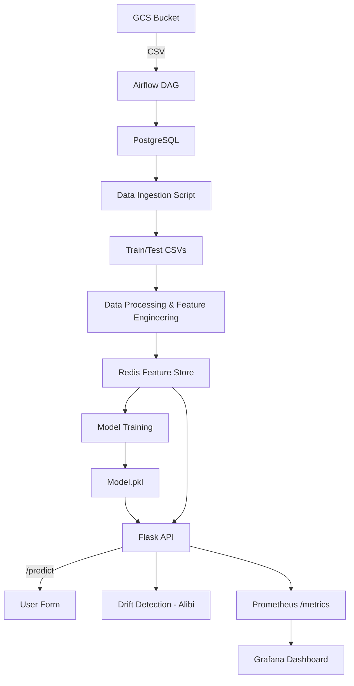
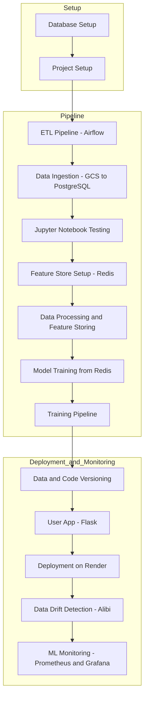

## 🚀 SurviverFlow – End-to-End MLOps Pipeline for Survival Prediction

[](https://www.python.org/)
[](https://flask.palletsprojects.com/)
[](https://upstash.com/)
[](https://airflow.apache.org/)
[](https://prometheus.io/)
[](https://grafana.com/)
[](https://medium.com/@dsdineshnitrr/building-surviverflow-an-end-to-end-mlops-pipeline-with-redis-airflow-prometheus-render-b2f3cb341c14)


**SurviverFlow** is a scalable, production-ready MLOps pipeline that predicts passenger survival using the survival prediction dataset. It covers the entire ML lifecycle—**data ingestion**, **feature storage**, **model training**, **drift detection**, **deployment**, and **monitoring**—with modern tools like Redis, Airflow, Flask, Prometheus, and Render.

---

## 📚 Table of Contents

- [🔑 Key Features](#-key-features)
- [🧱 Architecture Overview](#-architecture-overview)
- [📊 MLOps Workflow Diagram](#-mlops-workflow-diagram)
- [🗂️ Project Structure](#️-project-structure)
- [⚙️ Tech Stack](#️-tech-stack)
- [🔄 MLOps Pipeline Breakdown](#-mlops-pipeline-breakdown)
- [🖼️ Live Web App Interface](#️-live-web-app-interface)
- [📊 Monitoring via Grafana](#-monitoring-via-grafana)
- [🔧 How to Run Locally](#-how-to-run-locally)
- [🌍 Deployment (Render)](#-deployment-render)
- [📈 Monitoring Metrics](#-monitoring-metrics)
- [✅ Live App](#-live-app)
- [📌 Lessons & Enhancements](#-lessons--enhancements)
- [🙌 Acknowledgements](#-acknowledgements)
- [📄 License](#-license)

---

## 🔑 Key Features

- ✅ Automated Data Ingestion (GCP → PostgreSQL via Airflow)
- ⚙️ Redis Feature Store with real-time + batch support
- 🧠 Random Forest Classifier with hyperparameter tuning
- 🧼 Feature Engineering + Class Balancing (SMOTE)
- 🌐 Flask Web App for Real-Time Inference
- 🧠 Drift Detection via Alibi-Detect (KSDrift)
- 📈 Monitoring via Prometheus + Grafana
- 🐳 Dockerized & CI/CD-ready (Render)

---

## 🧱 Architecture Overview



---
## 📊 MLOps Workflow Diagram



## 🗂️ Project Structure

```
SURVIVERFLOW-main
├── app.py
├── Dockerfile
├── README.md
├── .astro/
├── dags/
│   └── extract_data_from_gcp.py
├── src/
│   ├── data_ingestion.py
│   ├── data_processing.py
│   ├── model_trainer.py
│   ├── feature_store.py
│   └── logger.py
├── pipeline/
├── artifacts/
│   └── models/random_forest_model.pkl
├── config/
├── notebook/
├── prometheus.yml
├── render.yml
├── requirements.txt
└── setup.py
```

---

## ⚙️ Tech Stack

| Layer           | Tools Used                              |
|----------------|------------------------------------------|
| Data Source     | GCP Bucket, PostgreSQL                   |
| Workflow Engine | Apache Airflow (Astro CLI)               |
| Feature Store   | Redis (Local Docker + Upstash Cloud)     |
| Model Training  | scikit-learn, Pandas, SMOTE              |
| Drift Detection | Alibi-Detect (KSDrift)                   |
| Monitoring      | Prometheus, Grafana                      |
| Serving Layer   | Flask + HTML                             |
| Deployment      | Docker, Render                           |

---

## 🔄 MLOps Pipeline Breakdown

### 🧮 Step 1: Data Ingestion
- Load CSV from **GCP Bucket**
- Airflow DAG writes data into **PostgreSQL**
- Validates schema and handles **null values**

### 🗃️ Step 2: Feature Store with Redis
- Store extracted features in **Redis**
- Supports both **batch and real-time** access
- Dual-mode support: **Local Docker** & **Upstash (Cloud Redis)**

### 🧼 Step 3: Data Preprocessing
- Handle **missing values** (Age, Fare, Embarked)
- Perform **Label Encoding** and **Feature Engineering**
- Balance classes using **SMOTE**

### 🧠 Step 4: Model Training
- Data is fetched directly from **Redis**
- Trains a **RandomForestClassifier** using **RandomizedSearchCV**
- Saves the model as `.pkl`

### 🔮 Step 5: Real-Time Prediction + Drift Detection
- Flask app exposes `/predict` route for **real-time inference**
- **Alibi Detect KSDrift** checks for data distribution shift
- **Prometheus** tracks prediction and drift metrics

### 📊 Step 6: Monitoring
- **Prometheus** exposes `/metrics` endpoint
- **Grafana Dashboards** visualize system usage and drift trends

### 🚀 Step 7: Deployment
- Fully containerized using **Docker + Gunicorn**
- **Render** used for one-click deployment
- Secrets like `REDIS_URL` managed securely via **Render Dashboard**

---

## 🖼️ Live Web App Interface

### ✅ Likely to Survive  


### ❌ Likely to Not Survive  


---

## 📊 Monitoring via Grafana


---

## 🔧 How to Run Locally

```bash
# 1. Clone the Repo
git clone https://github.com/aimldinesh/SURVIVERFLOW.git
cd SURVIVERFLOW

# 2. Set Redis URL in .env
echo "REDIS_URL=your_upstash_redis_url" > .env

# 3. Run Flask App Locally
python app.py

# OR Build with Docker
docker build -t survivorflow-app .
docker run -p 5000:5000 survivorflow-app
```

---

## 🌍 Deployment (Render)

Render setup with Docker + Redis service:

```yaml
services:
  - type: web
    name: survivorflow-app
    env: docker
    dockerfilePath: ./Dockerfile
    envVars:
      - key: REDIS_URL
        sync: false  # Set manually in Render dashboard
```

---

## 📈 Monitoring Metrics

| Metric            | Description                        |
|-------------------|------------------------------------|
| `prediction_count`| Number of predictions made         |
| `drift_count`     | Number of drift detections         |

Access at `/metrics` endpoint.

---

## ✅ Live App

👉 [https://surviverflow-1.onrender.com](https://surviverflow-1.onrender.com)

---

## 📌 Lessons & Enhancements

### 🔍 Key Learnings
- Using **Redis as a Feature Store** helped prevent data leakage
- **Drift Monitoring** with Alibi ensures long-term model reliability
- **Docker + Render** enabled fast and reproducible CI/CD deployment

📌 Want to learn how this project was built?
- 📝 I wrote a detailed Medium blog covering the full architecture, tools, and deployment process.
👉 [Read the blog on Medium](https://medium.com/@dsdineshnitrr/building-surviverflow-an-end-to-end-mlops-pipeline-with-redis-airflow-prometheus-render-b2f3cb341c14)

### 🛠️ Future Enhancements
- ✅ CI/CD via **GitHub Actions**
- ✅ Implement **Feature Versioning**
- ✅ Add **Retraining Pipelines**
- ✅ Set up **Slack/Email Alerts** for drift or failure
- ✅ Integrate **MLflow** for model registry and tracking

---

## 🙌 Acknowledgements

- [Titanic Dataset – Kaggle](https://www.kaggle.com/c/titanic)
- [Render](https://render.com)
- [Upstash Redis](https://upstash.com/)
- [Alibi-Detect](https://docs.seldon.io/projects/alibi-detect/)
- [ChatGPT](https://openai.com/chatgpt) – for architectural guidance

---

## 📄 License

This project is licensed under the **MIT License** – see the [LICENSE](LICENSE) file for details.
